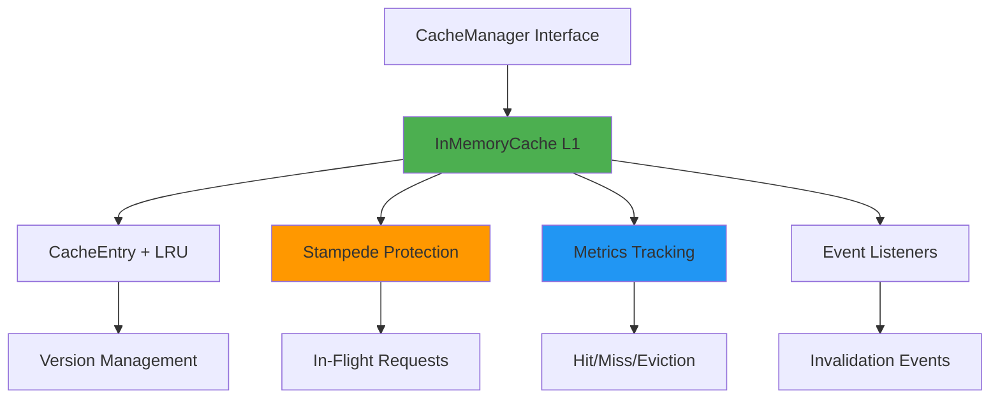

# Cache Package Documentation

## Overview

The `cache` package provides a production-ready, two-tier caching system with **stampede protection**, **LRU eviction**, and **optimistic locking** designed for high-performance distributed microservices. It implements version-aware operations and event-based invalidation to prevent race conditions in concurrent environments.

## Key Features

- **Stampede Protection**: Prevents thundering herd with request coalescing
- **LRU Eviction**: Automatic memory management with configurable limits
- **Version Management**: Optimistic locking with automatic version increments
- **Event-based Invalidation**: Listener pattern for cache invalidation notifications
- **TTL Support**: Automatic expiration and cleanup of cached entries
- **Performance Metrics**: Built-in hit rate, eviction, and size tracking
- **Context-Aware**: Honors context cancellation and timeouts
- **Thread Safety**: Concurrent access protection with read-write mutexes

## Architecture



## Configuration

### CacheConfig

Configure cache behavior and limits:

```go
type CacheConfig struct {
    MaxSizeBytes    int64         // Maximum memory (default: 100MB)
    MaxEntries      int           // Maximum entries (default: 10,000)
    CleanupInterval time.Duration // Cleanup frequency (default: 5 minutes)
    EnableMetrics   bool          // Enable metrics tracking (default: true)
}

// Create with custom config
config := &cache.CacheConfig{
    MaxSizeBytes:    50 * 1024 * 1024, // 50MB
    MaxEntries:      5000,
    CleanupInterval: 2 * time.Minute,
    EnableMetrics:   true,
}
cacheManager := cache.NewInMemoryCacheWithConfig(config)

// Or use defaults
cacheManager := cache.NewInMemoryCache()
```

## Interfaces

### CacheManager

The main interface for cache operations:

```go
type CacheManager interface {
    // Basic operations
    Get(ctx context.Context, key string) (any, bool)
    Set(ctx context.Context, key string, value any, ttl time.Duration) error
    Delete(ctx context.Context, key string) error
    Clear(ctx context.Context) error

    // Version-aware operations (optimistic locking)
    GetWithVersion(ctx context.Context, key string) (any, int64, bool)
    SetWithVersion(ctx context.Context, key string, value any, version int64, ttl time.Duration) error

    // Stampede-protected loading
    GetOrLoad(ctx context.Context, key string, ttl time.Duration, loader func() (any, error)) (any, error)

    // Event management
    AddInvalidationListener(key string, listener CacheInvalidationListener)
    RemoveInvalidationListener(key string, listener CacheInvalidationListener)
    
    // Observability
    GetMetrics() *CacheMetrics
}
```

### CacheInvalidationListener

Interface for receiving cache invalidation events:

```go
type CacheInvalidationListener interface {
    OnCacheInvalidated(key string, version int64)
}
```

## Types

### CacheEntry

Internal structure holding cached data with metadata:

```go
type CacheEntry struct {
    key       string        // Cache key
    data      any           // The cached value
    version   int64         // Version for optimistic locking
    expiresAt time.Time     // Expiration timestamp
    size      int64         // Estimated size in bytes
    lruNode   *list.Element // LRU doubly-linked list node
}
```

**Note**: `CacheEntry` is an internal implementation detail and should not be used directly by consumers.

### CacheMetrics

Performance metrics for monitoring cache health:

```go
type CacheMetrics struct {
    Hits        atomic.Int64 // Cache hits
    Misses      atomic.Int64 // Cache misses
    Sets        atomic.Int64 // Set operations
    Deletes     atomic.Int64 // Delete operations
    Evictions   atomic.Int64 // LRU evictions
    Expirations atomic.Int64 // TTL expirations
    Size        atomic.Int64 // Current size in bytes
    Entries     atomic.Int64 // Current number of entries
}

// Get hit rate percentage
func (m *CacheMetrics) HitRate() float64
```

### CacheVersionConflictError

Error returned when optimistic locking detects a version conflict:

```go
type CacheVersionConflictError struct {
    Key             string // Cache key that caused the conflict
    ExpectedVersion int64  // Version expected by the operation
    CurrentVersion  int64  // Actual version in cache
}
```

## Usage Examples

### Basic Caching

```go
import (
    "context"
    "time"
    "encore.app/core/cache"
)

// Create cache instance
cacheManager := cache.NewInMemoryCache()

// Set with TTL
ctx := context.Background()
userData := &User{ID: "123", Name: "John"}
err := cacheManager.Set(ctx, "user:123", userData, 30*time.Minute)

// Get cached value
if data, ok := cacheManager.Get(ctx, "user:123"); ok {
    user := data.(*User)
    fmt.Println("Cached user:", user.Name)
}

// Delete from cache
err = cacheManager.Delete(ctx, "user:123")
```

### Stampede-Protected Loading (NEW)

Prevents multiple concurrent requests from loading the same data:

```go
func (s *BookingService) GetBooking(ctx context.Context, bookingID string) (*Booking, error) {
    key := fmt.Sprintf("booking:%s", bookingID)
    
    // GetOrLoad ensures only ONE database query even with 100 concurrent requests
    result, err := s.cache.GetOrLoad(
        ctx,
        key,
        5*time.Minute,
        func() (any, error) {
            // This loader function runs ONLY ONCE per key
            return s.repo.GetByID(ctx, bookingID)
        },
    )
    
    if err != nil {
        return nil, err
    }
    
    return result.(*Booking), nil
}
```

**Benefits:**
- ✅ Prevents duplicate database queries
- ✅ Protects external API rate limits (Paystack, etc.)
- ✅ Reduces CPU/memory from redundant computations
- ✅ Automatic cache population on load

### Version-Aware Operations (Optimistic Locking)

```go
func (s *BookingService) AcceptBooking(ctx context.Context, bookingID string) error {
    // Get current booking with version
    key := fmt.Sprintf("booking:%s", bookingID)
    data, currentVersion, exists := s.cache.GetWithVersion(ctx, key)
    if !exists {
        return ErrBookingNotFound
    }
    
    booking := data.(*Booking)
    
    // Check business rules
    if booking.Status != "requested" {
        return ErrBookingNotAvailable
    }
    
    // Update booking
    booking.Status = "accepted"
    booking.AcceptedAt = time.Now()
    
    // Atomic update with version check
    err := s.cache.SetWithVersion(ctx, key, booking, currentVersion, 30*time.Minute)
    if err != nil {
        var conflictErr *cache.CacheVersionConflictError
        if errors.As(err, &conflictErr) {
            // Another artisan accepted this booking concurrently
            return ErrBookingAlreadyAccepted
        }
        return fmt.Errorf("failed to accept booking: %w", err)
    }
    
    return nil
}
```

### Cache Invalidation Listeners

```go
// Implement listener
type BookingCacheListener struct {
    notificationService *NotificationService
}

func (l *BookingCacheListener) OnCacheInvalidated(key string, version int64) {
    // Send notification when booking is updated
    bookingID := strings.TrimPrefix(key, "booking:")
    l.notificationService.SendBookingUpdate(bookingID, version)
}

// Register listener
listener := &BookingCacheListener{notificationService: notifSvc}
cacheManager.AddInvalidationListener("booking:*", listener)

// Remove listener when done
defer cacheManager.RemoveInvalidationListener("booking:*", listener)
```

### Monitoring Cache Performance

```go
// Get metrics
metrics := cacheManager.GetMetrics()

log.Printf("Cache Performance:")
log.Printf("  Hit Rate: %.2f%%", metrics.HitRate())
log.Printf("  Hits: %d", metrics.Hits.Load())
log.Printf("  Misses: %d", metrics.Misses.Load())
log.Printf("  Current Size: %d bytes", metrics.Size.Load())
log.Printf("  Entries: %d", metrics.Entries.Load())
log.Printf("  Evictions: %d", metrics.Evictions.Load())
log.Printf("  Expirations: %d", metrics.Expirations.Load())

// Set up metrics exporter for Prometheus/Grafana
func (s *Service) ExportMetrics() {
    metrics := s.cache.GetMetrics()
    prometheus.Gauge("cache_hit_rate").Set(metrics.HitRate())
    prometheus.Counter("cache_hits_total").Add(float64(metrics.Hits.Load()))
    prometheus.Counter("cache_misses_total").Add(float64(metrics.Misses.Load()))
    prometheus.Gauge("cache_size_bytes").Set(float64(metrics.Size.Load()))
    prometheus.Gauge("cache_entries").Set(float64(metrics.Entries.Load()))
}
```

## Booking Workflow Integration

### Preventing Double-Booking Race Conditions

```go
func (s *BookingService) AcceptBooking(ctx context.Context, bookingID string, artisanID string) error {
    key := fmt.Sprintf("booking:%s", bookingID)
    
    // Load with stampede protection
    result, err := s.cache.GetOrLoad(ctx, key, 5*time.Minute, func() (any, error) {
        return s.repo.GetByID(ctx, bookingID)
    })
    if err != nil {
        return err
    }
    
    booking := result.(*Booking)
    currentVersion := booking.Version
    
    // Validate booking state
    if booking.Status != "requested" {
        return ErrBookingNotAvailable
    }
    
    // Update booking
    booking.Status = "accepted"
    booking.ArtisanID = artisanID
    booking.AcceptedAt = time.Now()
    booking.Version = currentVersion + 1
    
    // Atomic update with optimistic locking
    err = s.cache.SetWithVersion(ctx, key, booking, currentVersion, 30*time.Minute)
    if err != nil {
        var conflictErr *cache.CacheVersionConflictError
        if errors.As(err, &conflictErr) {
            // Race condition detected - another artisan won
            return ErrBookingAlreadyAccepted
        }
        return fmt.Errorf("failed to update cache: %w", err)
    }
    
    // Persist to database
    return s.repo.Update(ctx, booking)
}
```

### Cross-Service Cache Invalidation

```go
func (s *BookingService) CompleteBooking(ctx context.Context, bookingID string) error {
    key := fmt.Sprintf("booking:%s", bookingID)
    
    // Update booking status
    booking, err := s.updateBookingStatus(ctx, bookingID, "completed")
    if err != nil {
        return err
    }
    
    // Cache update automatically triggers listeners in other services:
    // - Payment service refreshes payment status
    // - Notification service sends completion notifications
    // - Analytics service updates metrics
    err = s.cache.Set(ctx, key, booking, 1*time.Hour)
    
    return err
}
```

## Best Practices

### 1. Use Stampede Protection for Expensive Operations

Always use `GetOrLoad` for:
- Database queries
- External API calls (Paystack, etc.)
- Complex computations (pricing calculations)
- Artisan matching algorithms

```go
// ✅ GOOD: Stampede-protected
booking, err := cache.GetOrLoad(ctx, key, ttl, func() (any, error) {
    return expensiveDatabaseQuery(ctx, id)
})

// ❌ BAD: Multiple concurrent loads
booking, ok := cache.Get(ctx, key)
if !ok {
    booking = expensiveDatabaseQuery(ctx, id) // Multiple goroutines execute this!
    cache.Set(ctx, key, booking, ttl)
}
```

### 2. Use Version-Aware Operations for Critical Data

Always use `GetWithVersion` and `SetWithVersion` for:
- Financial transactions
- Booking state changes
- User status updates
- Inventory modifications

### 3. Set Appropriate TTL Values

| Data Type | Recommended TTL | Reason |
|-----------|----------------|---------|
| User sessions | 24 hours | Balance security and UX |
| Booking data | 5-30 minutes | Real-time updates needed |
| Artisan profiles | 1 hour | Relatively static |
| Quote calculations | 5-15 minutes | Price volatility |
| Payment status | 2-5 minutes | Critical for accuracy |
| Reference data | 24-48 hours | Rarely changes |

### 4. Configure Cache Size Appropriately

```go
// Production recommendations
config := &cache.CacheConfig{
    // Booking Service: High churn, medium TTL
    MaxSizeBytes:    200 * 1024 * 1024, // 200MB
    MaxEntries:      20000,
    CleanupInterval: 3 * time.Minute,
    
    // Artisan Service: Large profiles, longer TTL
    MaxSizeBytes:    500 * 1024 * 1024, // 500MB
    MaxEntries:      100000,
    CleanupInterval: 5 * time.Minute,
    
    // Payment Service: Small, critical data
    MaxSizeBytes:    50 * 1024 * 1024, // 50MB
    MaxEntries:      5000,
    CleanupInterval: 2 * time.Minute,
}
```

### 5. Monitor Cache Performance

Track these metrics:
- **Hit Rate**: >80% is healthy
- **Eviction Rate**: High evictions = increase MaxSize
- **Version Conflicts**: Frequent conflicts = reduce TTL
- **Memory Usage**: Should stay under MaxSizeBytes

```go
// Alert on poor performance
metrics := cache.GetMetrics()
if metrics.HitRate() < 70.0 {
    log.Warn("Cache hit rate below 70%")
}
if metrics.Evictions.Load() > metrics.Sets.Load()/2 {
    log.Warn("High eviction rate - consider increasing MaxSizeBytes")
}
```

## Error Handling

### CacheVersionConflictError

Indicates optimistic locking failure:

```go
err := cache.SetWithVersion(ctx, key, value, expectedVersion, ttl)
if err != nil {
    var conflictErr *cache.CacheVersionConflictError
    if errors.As(err, &conflictErr) {
        // Data was modified by another process
        log.Warnf("Version conflict: expected %d, got %d", 
            conflictErr.ExpectedVersion, conflictErr.CurrentVersion)
        
        // Implement retry with exponential backoff
        return retryWithBackoff(ctx, func() error {
            // Reload and retry
            newData, newVersion, _ := cache.GetWithVersion(ctx, key)
            return cache.SetWithVersion(ctx, key, updateData(newData), newVersion, ttl)
        })
    }
    return fmt.Errorf("cache operation failed: %w", err)
}
```

### Context Cancellation

All cache operations respect context cancellation:

```go
ctx, cancel := context.WithTimeout(context.Background(), 2*time.Second)
defer cancel()

booking, err := cache.GetOrLoad(ctx, key, ttl, func() (any, error) {
    // This loader respects ctx cancellation
    return slowDatabaseQuery(ctx, id)
})

if err != nil {
    if ctx.Err() == context.DeadlineExceeded {
        return ErrTimeout
    }
    return err
}
```

## Performance Considerations

### Memory Management
- **Automatic Eviction**: LRU evicts least recently used entries when limits reached
- **Size Estimation**: Rough estimation for common types (string, []byte, maps)
- **Monitor Usage**: Track `metrics.Size` to ensure memory efficiency

### Concurrency
- **Lock Contention**: Uses `sync.RWMutex` for minimal read contention
- **Stampede Protection**: In-flight request tracking prevents duplicate loads
- **Listener Safety**: Event notifications run in goroutines to avoid blocking

### Cleanup
- **Periodic Cleanup**: Removes expired entries every `CleanupInterval`
- **Lazy Cleanup**: Expired entries detected on `Get` are cleaned immediately
- **Graceful Shutdown**: Call `cache.Stop()` to cleanup goroutines

## Implementation Notes

- **InMemoryCache**: Concrete implementation - treat as internal detail
- **Automatic Expiration**: Expired entries trigger invalidation listeners
- **Panic Recovery**: Listeners that panic are handled gracefully
- **Context Support**: All operations honor cancellation and timeouts
- **Thread-Safe Metrics**: Uses `atomic.Int64` for lock-free counters

## Integration with Encore Services

The cache integrates seamlessly with your Encore microservices:

```go
// In core/service.go
func NewCoreService(db *gorm.DB) *CoreService {
    config := &cache.CacheConfig{
        MaxSizeBytes:    100 * 1024 * 1024, // 100MB
        MaxEntries:      10000,
        CleanupInterval: 5 * time.Minute,
        EnableMetrics:   true,
    }
    
    return &CoreService{
        db:            db,
        cache:         cache.NewInMemoryCacheWithConfig(config),
        healthMonitor: newHealthMonitor(db, cache.NewInMemoryCache()),
    }
}

// In your service
func initService() (*Service, error) {
    // ... other initialization ...
    
    cacheSvc := core.NewCoreService(db)
    return &Service{
        cache: cacheSvc.Cache(), // Use production-ready cache
        // ... other fields ...
    }, nil
}
```

## Migration from Basic Cache

Existing code using basic `Get`/`Set` operations continues to work unchanged. Gradually migrate to enhanced features:

```go
// Old way (still works)
cache.Set(ctx, "booking:123", booking, 30*time.Minute)

// Better: Stampede-protected
booking, err := cache.GetOrLoad(ctx, "booking:123", 30*time.Minute, func() (any, error) {
    return repo.GetByID(ctx, "123")
})

// Best: Stampede-protected + Optimistic locking
booking, err := cache.GetOrLoad(ctx, "booking:123", 30*time.Minute, loadFunc)
// ... update booking ...
cache.SetWithVersion(ctx, "booking:123", booking, currentVersion, 30*time.Minute)
```

## Troubleshooting

### Common Issues

#### 1. High Version Conflict Rate
**Symptoms**: Frequent `CacheVersionConflictError`

**Solutions:**
- Reduce TTL for frequently updated items
- Implement retry logic with exponential backoff
- Consider eventual consistency for non-critical updates

```go
// Retry with exponential backoff
for attempt := 0; attempt < 3; attempt++ {
    err := updateWithVersion(ctx, key, value)
    if err == nil {
        break
    }
    var conflictErr *cache.CacheVersionConflictError
    if errors.As(err, &conflictErr) {
        time.Sleep(time.Duration(attempt*100) * time.Millisecond)
        continue
    }
    return err
}
```

#### 2. Low Cache Hit Rate (<70%)
**Symptoms**: `metrics.HitRate() < 70`

**Solutions:**
- Increase `MaxSizeBytes` to reduce evictions
- Increase TTL for stable data
- Investigate if data is actually reused
- Check if keys are consistent

#### 3. High Memory Usage
**Symptoms**: Cache size approaching `MaxSizeBytes`

**Solutions:**
- Reduce `MaxEntries` or `MaxSizeBytes`
- Shorten TTL for less critical data
- Implement tiered caching (L1 + L2 Redis)
- Monitor `metrics.Evictions` - high evictions indicate undersized cache

#### 4. Performance Degradation
**Symptoms**: Slow cache operations

**Solutions:**
- Profile lock contention with `go tool trace`
- Check listener goroutine count
- Reduce `CleanupInterval` if many expired entries
- Consider sharding cache by key prefix

## Advanced: Two-Tier Caching (L1 + L2 Redis)

For distributed deployments, combine InMemoryCache (L1) with Encore Redis (L2):

```go
type TwoTierCache struct {
    local  cache.CacheManager    // L1: InMemoryCache
    remote *redis.Client         // L2: Encore Redis
}

func (c *TwoTierCache) Get(ctx context.Context, key string) (any, bool) {
    // Check L1 first (fast)
    if val, ok := c.local.Get(ctx, key); ok {
        return val, true
    }
    
    // Check L2 (distributed)
    var data any
    err := c.remote.Get(ctx, key).Scan(&data)
    if err == nil {
        // Populate L1
        c.local.Set(ctx, key, data, 5*time.Minute)
        return data, true
    }
    
    return nil, false
}
```

***

This cache implementation provides **production-ready** performance with stampede protection, LRU eviction, and comprehensive metrics for Phase 2 MVP and beyond! 🚀