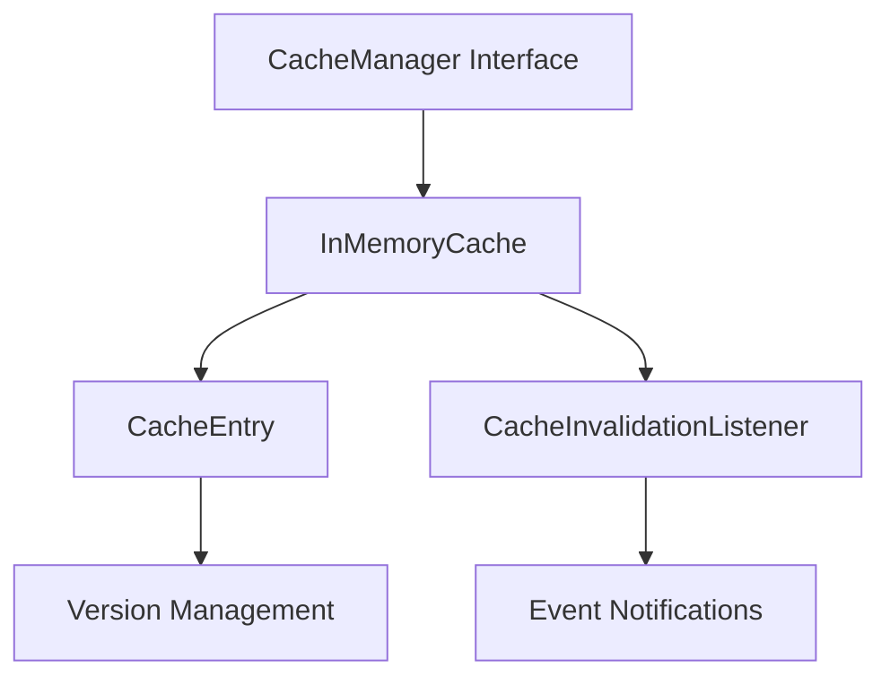

# Cache Package Documentation

## Overview

The `cache` package provides a thread-safe, version-aware caching system designed for distributed microservices with strong consistency requirements. It implements optimistic locking and event-based invalidation to prevent race conditions in concurrent environments.

## Key Features

- **Version Management**: Optimistic locking with automatic version increments
- **Event-based Invalidation**: Listener pattern for cache invalidation notifications
- **TTL Support**: Automatic expiration and cleanup of cached entries
- **Thread Safety**: Concurrent access protection with read-write mutexes
- **Error Handling**: Graceful handling of version conflicts and panics

## Architecture



## Interfaces

### CacheManager

The main interface for cache operations:

```go
type CacheManager interface {
    // Basic operations
    Get(ctx context.Context, key string) (any, bool)
    Set(ctx context.Context, key string, value any, ttl time.Duration) error
    Delete(ctx context.Context, key string) error
    Clear(ctx context.Context) error

    // Version-aware operations
    GetWithVersion(ctx context.Context, key string) (any, int64, bool)
    SetWithVersion(ctx context.Context, key string, value any, version int64, ttl time.Duration) error

    // Event management
    AddInvalidationListener(key string, listener CacheInvalidationListener)
    RemoveInvalidationListener(key string, listener CacheInvalidationListener)
}
```

### CacheInvalidationListener

Interface for receiving cache invalidation events:

```go
type CacheInvalidationListener interface {
    OnCacheInvalidated(key string, version int64)
}
```

## Types

### CacheEntry

Internal structure holding cached data with metadata:

```go
type CacheEntry struct {
    Data      any       `json:"data"`      // The cached value
    Version   int64     `json:"version"`   // Version for optimistic locking
    ExpiresAt time.Time `json:"expires_at"` // Expiration timestamp
}
```

**Note**: `CacheEntry` is an internal implementation detail and should not be used directly by consumers of the cache.

### CacheVersionConflictError

Error returned when optimistic locking detects a version conflict:

```go
type CacheVersionConflictError struct {
    Key             string `json:"key"`             // Cache key that caused the conflict
    ExpectedVersion int64  `json:"expected_version"` // Version expected by the operation
    CurrentVersion  int64  `json:"current_version"`  // Actual version in cache
}
```

**Note**: This error is returned as a pointer type (`*CacheVersionConflictError`).

## Usage Examples

### Basic Caching

```go
import (
    "context"
    "time"
    "encore.app/core/cache"
)
// Create cache instance
cacheManager := cache.NewInMemoryCache()

// Set with TTL
ctx := context.Background()
err := cacheManager.Set(ctx, "user:123", userData, 30*time.Minute)

// Register listener
cacheManager.AddInvalidationListener("booking:456", &BookingCacheListener{})

// Remove listener when done
```

## Booking Workflow Integration

### Preventing Double-Booking Race Conditions

```go
import (
    "context"
    "errors"
    "fmt"
    "time"
    "encore.app/core/cache"
)

func (s *BookingService) AcceptBooking(ctx context.Context, bookingID string) error {
    // Get current booking with version
    key := fmt.Sprintf("booking:%s", bookingID)
    _, currentVersion, exists := s.cache.GetWithVersion(ctx, key)
    if !exists {
        return ErrBookingNotFound
    }

    // Check business rules
    if !canAcceptBooking(booking) {
        return ErrCannotAcceptBooking
    }

    // Optimistic update
    updatedBooking := booking
    updatedBooking.Status = "accepted"
    updatedBooking.AcceptedAt = time.Now()

    err := s.cache.SetWithVersion(ctx, key, updatedBooking, currentVersion, 30*time.Minute)
    if err != nil {
        var conflictErr *cache.CacheVersionConflictError
        if errors.As(err, &conflictErr) {
            // Another artisan accepted this booking
            return ErrBookingAlreadyAccepted
        }
        return fmt.Errorf("failed to accept booking: %w", err)
    }

    return nil
}
```

### Cross-Service Cache Invalidation

```go
func (s *BookingService) CompleteBooking(ctx context.Context, bookingID string) error {
    // Update booking status
    key := fmt.Sprintf("booking:%s", bookingID)
    // ... update logic ...

    // Invalidation automatically triggers listeners in other services
    // - Payment service refreshes payment status
    // - Notification service sends completion notifications
    // - Analytics service updates metrics

    return nil
}
```

## Best Practices

### 1. Use Version-Aware Operations for Critical Data

Always use `GetWithVersion` and `SetWithVersion` for:
- Financial transactions
- Booking state changes
- User status updates
- Inventory modifications

### 2. Handle Version Conflicts Gracefully

err := cache.SetWithVersion(ctx, key, value, expectedVersion, ttl)
if err != nil {
    var conflictErr *cache.CacheVersionConflictError
    if errors.As(err, &conflictErr) {
        // Data was modified by another process
        // Implement retry or conflict resolution strategy
        return handleConflict(conflictErr)
    }
    return fmt.Errorf("cache operation failed: %w", err)
}
### 3. Set Appropriate TTL Values

- **User sessions**: 24 hours
- **Booking data**: 1-2 hours (depends on workflow duration)
- **Reference data**: 24-48 hours
- **Computed results**: 30 minutes - 2 hours

### 4. Monitor Cache Performance

Track these metrics:
- Cache hit/miss ratios
- Version conflict rates
- Invalidation frequency
- Memory usage patterns

## Error Handling

### CacheVersionConflictError

Indicates optimistic locking failure:

```go
if errors.Is(err, &cache.CacheVersionConflictError{}) {
    // Data was modified by another process
    // Implement retry or conflict resolution strategy
}
```

### Context Cancellation

All cache operations respect context cancellation:

```go
ctx, cancel := context.WithTimeout(context.Background(), 5*time.Second)
defer cancel()

data, exists, err := cache.GetWithVersion(ctx, key)
if err != nil {
    if ctx.Err() == context.DeadlineExceeded {
        return ErrTimeout
    }
    return err
}
```

## Performance Considerations

- **Memory Usage**: Monitor cache size and implement size limits if needed
- **Cleanup Frequency**: Current implementation cleans every 5 minutes
- **Listener Overhead**: Event notifications run in goroutines to avoid blocking
- **Lock Contention**: Use read locks for frequent reads, write locks for updates

## Implementation Notes

- **InMemoryCache**: The concrete implementation type - treat as internal detail
- **Automatic Expiration**: Expired entries trigger invalidation listeners
- **Panic Recovery**: Listeners that panic are handled gracefully
- **Context Support**: All operations respect context cancellation and timeouts

## Integration with Encore Services

The cache integrates seamlessly with your Encore microservices:

```go
// In your service initialization
func initService() (*Service, error) {
    // ... other initialization ...

    cacheSvc := core.NewCoreService(db)
    return &Service{
        cache: cacheSvc.Cache(), // Use the version-aware cache
        // ... other fields ...
    }, nil
}
```

## Migration from Basic Cache

Existing code using basic `Get`/`Set` operations continues to work unchanged. Gradually migrate critical operations to use version-aware methods:

```go
// Old way (still works)
cache.Set(ctx, "booking:123", booking, 30*time.Minute)

// New way (recommended for critical operations)
cache.SetWithVersion(ctx, "booking:123", booking, currentVersion, 30*time.Minute)
```

## Troubleshooting

### Common Issues

1. **High Version Conflict Rate**
   - Reduce TTL for frequently updated items
   - Implement retry logic with exponential backoff
   - Consider using shorter cache durations

2. **Memory Leaks**
   - Monitor goroutine count from listeners
   - Ensure listeners are removed when no longer needed
   - Check for circular references in cached objects

3. **Performance Degradation**
   - Profile lock contention
   - Consider cache size limits
   - Implement cache warming for frequently accessed data

This cache implementation provides the consistency guarantees needed for your booking marketplace while maintaining high performance and ease of use.
